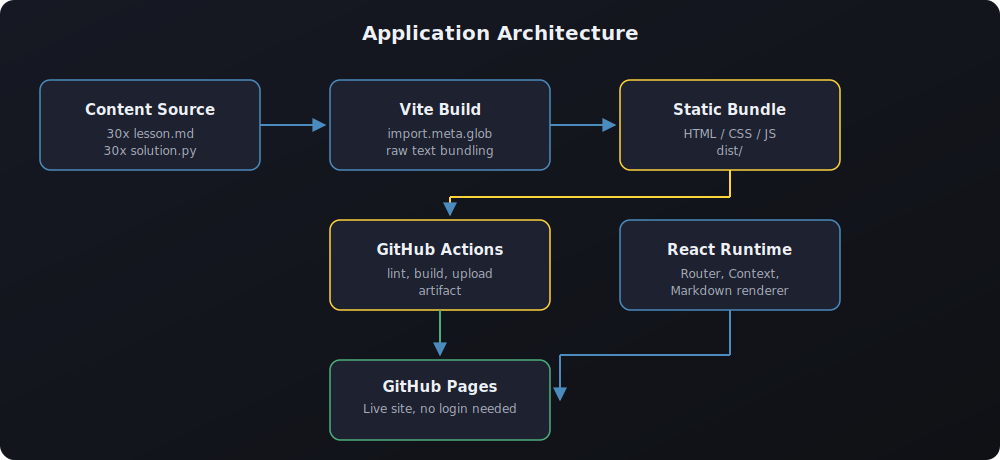

<div align="center">


<br/>

[](https://react.dev)
[](https://www.typescriptlang.org)
[](https://vitejs.dev)
[](./LICENSE)
[](https://pages.github.com)

<br/>

> **A free, interactive Python programming course rebuilt as a modern single page application. Thirty daily lessons, thirty hands on projects, full navigation freedom, and a downloadable certificate. No login required to learn, no login required to graduate.**

<br/>

[](#)
&nbsp;&nbsp;
[](#getting-started)

</div>

---

## Table of Contents

- [About](#about)
- [Key Principles](#key-principles)
- [Feature Overview](#feature-overview)
- [Screenshots](#screenshots)
- [Tech Stack](#tech-stack)
- [Architecture](#architecture)
- [Project Structure](#project-structure)
- [Getting Started](#getting-started)
- [Available Scripts](#available-scripts)
- [Deployment to GitHub Pages](#deployment-to-github-pages)
- [Curriculum](#curriculum)
- [Authentication Model](#authentication-model)
- [Certificate](#certificate)
- [Accessibility and Design](#accessibility-and-design)
- [Roadmap](#roadmap)
- [Contributing](#contributing)
- [License](#license)

---

## About

This repository is a TypeScript and React rebuild of the original **Python in 30 Days** Markdown course. Every lesson and every project solution from the original curriculum has been preserved, and wrapped in a fast, accessible, single page application that works entirely in the browser with zero backend.

The rebuild was guided by one rule above all others: **learning should never be blocked**. There is no wall between a visitor and the content. There is no test a learner must pass to move forward. There is no account required to read a single lesson or to walk away with a certificate.

## Key Principles

| Principle | What it means in this app |
|---|---|
| Content first | Every one of the 30 lessons and 30 project solutions is reachable in one click from the sidebar, with no gating. |
| Free navigation | Previous and Next buttons always work. Nothing checks whether you "passed" the current day before letting you continue. |
| Optional accounts | A login and signup flow exists purely as a UI showcase. It personalizes a greeting and nothing more. |
| No login certificate | The certificate page asks for a name, renders a certificate live, and lets you download it as a PNG. No account, no server, no quiz score required. |
| Static and portable | The whole app is a static bundle. It ships to GitHub Pages with a single GitHub Actions workflow and needs no server, database or API keys. |

## Feature Overview

- **30 day curriculum** covering fundamentals, data structures, control flow, functions, error handling, file I/O, Pythonic idioms, object oriented programming, decorators, generators, context managers, regular expressions, JSON and CSV, working with APIs, and testing with pytest.
- **Markdown powered lessons** rendered with syntax highlighted code blocks, tables, and callouts, sourced from the original course content.
- **Project solution viewer** displaying the day's full `solution.py` file with Python syntax highlighting.
- **Free form navigation** with a persistent sidebar grouped by topic, a home page grid of every day, and Previous and Next controls on each lesson.
- **Optional progress tracker** stored in the browser that lets a learner mark days complete, purely for their own bookkeeping. It is never used to lock content.
- **Showcase authentication** with login and signup screens, clearly labeled as a demonstration, backed by `localStorage` instead of a real backend.
- **No login certificate generator** that renders an SVG certificate live and exports it as a downloadable PNG image.
- **Responsive, accessible UI** that works on mobile, tablet and desktop, with a collapsible navigation drawer on small screens.
- **Continuous deployment** to GitHub Pages through a GitHub Actions workflow that lints, type checks, builds and publishes the site automatically on every push to `main`.

## Screenshots

<div align="center">

| Home | Lesson View | Certificate |
|---|---|---|
| Curriculum grid with progress stats | Markdown lesson with code and project panel | Live certificate preview and PNG export |

</div>

> Replace the placeholders above with real screenshots once the project is deployed. Recommended path: `docs/screenshots/home.png`, `docs/screenshots/lesson.png`, `docs/screenshots/certificate.png`.

## Tech Stack

<div align="center">

[](https://react.dev)
[](https://www.typescriptlang.org)
[](https://vitejs.dev)
[](https://reactrouter.com)
[](https://eslint.org)
[](https://github.com/features/actions)
[](https://pages.github.com)

</div>

| Layer | Choice | Why |
|---|---|---|
| UI framework | React 18 with function components and hooks | Predictable state management for navigation, auth and progress |
| Language | TypeScript, strict mode | Type safety across routing, context and content loading |
| Build tool | Vite | Instant dev server, native ES modules, first class static asset handling |
| Routing | React Router 6, `HashRouter` | Client side routing that survives a full page refresh on GitHub Pages without a server rewrite rule |
| Content | Raw Markdown and Python files bundled with `import.meta.glob` | Keeps the original lesson content as the single source of truth, no CMS or database needed |
| Markdown rendering | `react-markdown` with `remark-gfm` | Tables, task lists and full GitHub flavored Markdown support |
| Code highlighting | `react-syntax-highlighter` | Accurate Python syntax highlighting for lessons and project solutions |
| State | React Context plus `localStorage` | Lightweight, dependency free persistence for the showcase auth and progress tracker |
| CI/CD | GitHub Actions | Lint, type check, build and deploy automatically on every push |
| Hosting | GitHub Pages | Free static hosting with a custom domain option |

## Architecture

<div align="center">

</div>

The application is intentionally simple:

1. Thirty lesson files (`lesson.md`) and thirty project files (`solution.py`) live under `src/content/day-XX/`.
2. Vite bundles that content at build time as raw text using `import.meta.glob`, so there is no runtime fetch and no flash of missing content.
3. React Router renders a `Layout` shell (navbar plus sidebar) around each page. The `DayPage` route resolves a day number from the URL, pulls the matching Markdown and Python content, and renders it with free Previous and Next controls.
4. Two React contexts back the interactive pieces of the UI: `AuthContext` for the showcase login state and `ProgressContext` for the optional "mark complete" tracker. Both persist to `localStorage` only, keeping the app entirely static.
5. GitHub Actions builds the app on every push to `main`, then publishes the `dist/` output to GitHub Pages using the official `actions/deploy-pages` action.

## Project Structure

```text
python-30-days-react/
├── .github/
│   └── workflows/
│       ├── ci.yml            CI checks on pull requests
│       └── deploy.yml        Build and deploy to GitHub Pages
├── docs/
│   ├── banner.svg
│   └── architecture.svg
├── public/
│   └── favicon.svg
├── src/
│   ├── components/
│   │   ├── Layout.tsx        Page shell: navbar + sidebar + outlet
│   │   ├── Navbar.tsx        Top navigation, progress meter, auth controls
│   │   ├── Sidebar.tsx       Full curriculum list grouped by topic
│   │   ├── Footer.tsx
│   │   ├── CodeBlock.tsx     Syntax highlighted code renderer
│   │   └── Certificate.tsx   SVG certificate template
│   ├── context/
│   │   ├── AuthContext.tsx     Showcase-only auth, localStorage backed
│   │   └── ProgressContext.tsx Optional, non-blocking progress tracker
│   ├── data/
│   │   ├── curriculum.ts     Static metadata for all 30 days
│   │   └── content.ts        Loads raw lesson/solution files at build time
│   ├── content/
│   │   └── day-01 .. day-30/
│   │       ├── lesson.md
│   │       └── solution.py
│   ├── pages/
│   │   ├── Home.tsx
│   │   ├── DayPage.tsx
│   │   ├── Login.tsx
│   │   ├── Signup.tsx
│   │   ├── CertificatePage.tsx
│   │   └── NotFound.tsx
│   ├── App.tsx
│   ├── main.tsx
│   └── index.css
├── index.html
├── vite.config.ts
├── tsconfig.json
├── package.json
└── README.md
```

## Getting Started

### Prerequisites

- [Node.js](https://nodejs.org) 20 or later
- npm 10 or later (bundled with Node.js)

### Installation

```bash
git clone https://github.com/<your-username>/python-30-days-react.git
cd python-30-days-react
npm install
```

### Run the development server

```bash
npm run dev
```

The app will be available at `http://localhost:5173`.

### Build for production

```bash
npm run build
npm run preview
```

## Available Scripts

| Script | Description |
|---|---|
| `npm run dev` | Starts the Vite development server with hot module reload |
| `npm run build` | Type checks the project and produces an optimized build in `dist/` |
| `npm run preview` | Serves the production build locally to sanity check before deploying |
| `npm run lint` | Runs ESLint across the codebase |

## Deployment to GitHub Pages

This project deploys itself. The included workflow at `.github/workflows/deploy.yml` runs on every push to `main` and:

1. Checks out the repository
2. Installs dependencies with `npm ci`
3. Lints and type checks the project
4. Builds the production bundle with `npm run build`
5. Uploads and publishes the `dist/` folder to GitHub Pages using `actions/deploy-pages`

### One time repository setup

1. Push this repository to GitHub.
2. In your repository, open **Settings → Pages**.
3. Under **Build and deployment**, set **Source** to **GitHub Actions**.
4. If your repository name is not `python-30-days-react`, update the `REPO_NAME` constant in `vite.config.ts` so the built asset paths match your GitHub Pages sub path.
5. Push to `main`. The **Deploy to GitHub Pages** workflow will build and publish automatically. Your site will be live at:

```text
https://<your-username>.github.io/<your-repo-name>/
```

The app uses React Router's `HashRouter`, so deep links such as `/#/day/12` work correctly on GitHub Pages without needing a custom 404 redirect trick.

## Curriculum

<div align="center">

| Week | Focus | Days |
|---|---|---|
| Week 1 | Fundamentals | Setup, Variables, Strings, Numbers, User Input |
| Week 2 | Data Structures and Control Flow | Lists, Tuples, Sets, Dictionaries, Conditionals, Loops |
| Week 3 | Functions and Robust Code | Functions, Type Hints, Scope, Error Handling, File I/O |
| Week 4 | Pythonic Code and OOP | Comprehensions, Lambda/Map/Filter, Modules, Classes, Inheritance, Dunder Methods |
| Week 5 | Advanced Python and Real Data | Decorators, Generators, Context Managers, Regex, JSON/CSV, APIs |
| Final Stretch | Professional Practices | Testing with pytest, Final CLI Todo App project |

</div>

Full day by day breakdown:

| Day | Title | Topic |
|---|---|---|
| 01 | Setup & Hello World | Fundamentals |
| 02 | Variables & Data Types | Fundamentals |
| 03 | Strings & String Methods | Fundamentals |
| 04 | Numbers & Math Operations | Fundamentals |
| 05 | User Input | Fundamentals |
| 06 | Lists | Data Structures |
| 07 | Tuples, Sets & Booleans | Data Structures |
| 08 | Dictionaries | Data Structures |
| 09 | Conditionals | Control Flow |
| 10 | for Loops | Control Flow |
| 11 | while Loops | Control Flow |
| 12 | Functions Basics | Functions |
| 13 | Function Arguments & Type Hints | Functions |
| 14 | Scope & Closures | Functions |
| 15 | Error Handling | Robust Code |
| 16 | File I/O | Robust Code |
| 17 | List Comprehensions | Pythonic Code |
| 18 | Lambda, Map, Filter & Sorted | Pythonic Code |
| 19 | Modules & Packages | Pythonic Code |
| 20 | OOP: Classes & Objects | Object Oriented Programming |
| 21 | OOP: Inheritance & Polymorphism | Object Oriented Programming |
| 22 | Dunder Methods | Object Oriented Programming |
| 23 | Decorators | Advanced Python |
| 24 | Generators & Iterators | Advanced Python |
| 25 | Context Managers | Advanced Python |
| 26 | Regular Expressions | Real World Data |
| 27 | JSON & CSV Data | Real World Data |
| 28 | Working with APIs | Real World Data |
| 29 | Testing with pytest | Professional Practices |
| 30 | Final Project: CLI Todo App | Professional Practices |

## Authentication Model

This project intentionally ships a login and signup screen that does **not** gate any content. It exists to demonstrate what an authenticated experience could look like in the UI, nothing more.

```text
                    ┌─────────────────────────┐
                    │   Visitor opens the app  │
                    └────────────┬────────────┘
                                 │
                 ┌───────────────┴────────────────┐
                 │                                 │
                 ▼                                 ▼
     ┌───────────────────────┐        ┌─────────────────────────┐
     │ Browses lessons freely │        │ Optionally signs up      │
     │ No account needed      │        │ or logs in (showcase)    │
     └───────────┬───────────┘        └────────────┬─────────────┘
                 │                                  │
                 ▼                                  ▼
     ┌───────────────────────┐        ┌─────────────────────────┐
     │ Marks days complete    │        │ Sees a personalized      │
     │ (stored in browser)    │        │ greeting in the navbar   │
     └───────────┬───────────┘        └────────────┬─────────────┘
                 │                                  │
                 └────────────────┬─────────────────┘
                                  ▼
                    ┌─────────────────────────┐
                    │ Generates certificate    │
                    │ any time, no login,      │
                    │ no test score required   │
                    └─────────────────────────┘
```

Key facts about the showcase auth:

- Accounts are stored in `localStorage` under the current browser only. There is no backend, no database and no network request involved.
- Signing up or logging in only changes the greeting shown in the navbar. It never unlocks or restricts any lesson.
- The certificate page never checks whether a user is logged in.

## Certificate

The `/certificate` route renders a live SVG certificate that updates as you type your name, and can be exported to a PNG file with a single click. There is no login requirement and no minimum number of completed lessons. The certificate is available the moment you land on the page, because learning should be rewarded on your terms, not gated behind arbitrary checkpoints.

## Accessibility and Design

- Semantic HTML throughout, including proper heading hierarchy inside rendered lessons.
- Keyboard accessible navigation links and buttons.
- Color palette inspired by the official Python brand colors (blue and yellow) on a high contrast dark theme for comfortable long reading sessions.
- Responsive layout with a collapsible sidebar drawer below 900px width.

## Roadmap

- [ ] Add optional dark and light theme toggle
- [ ] Add search across lessons
- [ ] Add code playground for running snippets in the browser
- [ ] Add downloadable PDF certificate in addition to PNG
- [ ] Add i18n support for translated lessons

## Contributing

Contributions are welcome. Please open an issue to discuss significant changes before submitting a pull request.

1. Fork the repository
2. Create a feature branch: `git checkout -b feature/my-improvement`
3. Commit your changes: `git commit -m "Add my improvement"`
4. Push to your branch: `git push origin feature/my-improvement`
5. Open a pull request

Please run `npm run lint` and `npm run build` locally before submitting a pull request. Both checks also run automatically in CI on every pull request.

## License

This project is licensed under the [MIT License](./LICENSE). Course content is adapted from the original Python in 30 Days curriculum and remains free for personal and educational use.

<div align="center">

Made for learners who just want to start writing Python, without filling out a form first.

</div>
