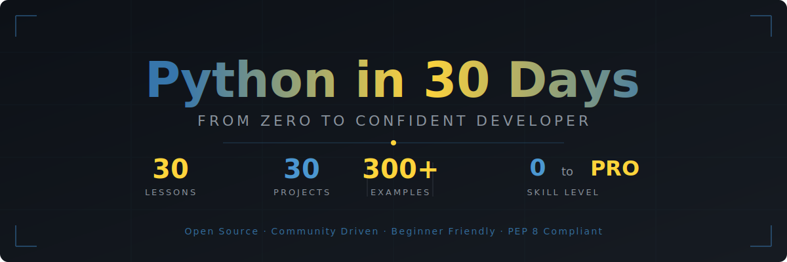

<div align="center">



<br/>

[](https://python.org)
[](./LICENSE)
[](./CONTRIBUTING.md)
[](https://github.com/hassanireza/python-30-days)
[](https://github.com/hassanireza/python-30-days)

<br/>

> **A complete, beginner-friendly Python programming course designed to take you from zero experience to building real projects in 30 days. Every lesson includes a hands-on project, clean code examples, and best practices used by professional Python developers.**

<br/>

[](./days/day-01/README.md)
&nbsp;&nbsp;
[](#-curriculum)

</div>

---

## Table of Contents

- [Why This Course?](#-why-this-course)
- [Who Is This For?](#-who-is-this-for)
- [Prerequisites](#-prerequisites)
- [How to Use This Course](#-how-to-use-this-course)
- [Curriculum](#-curriculum)
- [Project Gallery](#-project-gallery)
- [Python Best Practices](#-python-best-practices)
- [Community & Contributing](#-community--contributing)
- [License](#-license)

---

## Why This Course?

This repository was built on a simple idea: **the best way to learn Python is by writing Python**. Every single day, you will read a concept, see it explained with real examples, and then build something with it. No passive reading. No syntax memorization drills. Just code.

What makes this different from other Python tutorials:

| Feature | This Course | Typical Tutorial |
|---|---|---|
| Hands-on project every day | YES | Rarely |
| PEP 8 compliant examples | YES | Sometimes |
| Covers Python 3.10+ features | YES | Often outdated |
| Navigation between lessons | YES | No |
| Real-world project focus | YES | Toy examples |
| Free forever | YES | Usually paywalled |

---

## Who Is This For?

This course is built for:

- **Complete beginners** who have never written a line of code
- **Developers from other languages** making the move to Python
- **Students** who want structured, daily learning with clear goals
- **Self-taught programmers** who want to fill gaps and learn best practices

---

## Prerequisites

You do not need any prior programming experience. You need:

- A computer running Windows, macOS, or Linux
- An internet connection
- About 1 to 2 hours per day
- A genuine desire to build things

---

## How to Use This Course

```
One lesson per day.
Read the concept.
Study the examples.
Build the project.
Repeat.
```

Each day folder contains:

```
days/day-XX/
├── README.md        # Lesson content, concept explanation, code examples
└── project/
    ├── README.md    # Project brief, requirements, how to run
    └── solution.py  # Reference solution (try it yourself first!)
```

> **Tip:** Fork this repository and commit your daily work to your own fork. Watching your own progress is one of the most motivating things you can do as a learner.

### Recommended Workflow

1. Fork this repository
2. Read the day's `README.md` thoroughly
3. Try to write the project code yourself in a new file
4. Only check `solution.py` after you have genuinely tried
5. Commit your version to your fork
6. Move to the next day

---

## Curriculum

<details>
<summary><strong>Week 1: Python Foundations (Days 1-7)</strong></summary>

| Day | Topic | Concepts Covered | Project |
|:---:|---|---|---|
| [01](./days/day-01/README.md) | Setup & Hello World | Installation, `print()`, running scripts | Personal Info Card |
| [02](./days/day-02/README.md) | Variables & Data Types | `int`, `float`, `str`, `bool`, `type()` | Type Explorer |
| [03](./days/day-03/README.md) | Strings & String Methods | Indexing, slicing, `upper()`, `format()`, f-strings | Mad Libs Generator |
| [04](./days/day-04/README.md) | Numbers & Math | Operators, `math` module, `round()`, integer division | Scientific Calculator |
| [05](./days/day-05/README.md) | User Input | `input()`, type casting, `int()`, `float()` | Interactive Quiz |
| [06](./days/day-06/README.md) | Lists | Indexing, `append()`, `remove()`, slicing, `len()` | Shopping List Manager |
| [07](./days/day-07/README.md) | Tuples, Sets & Booleans | Immutability, sets, `in`, `not in`, comparisons | Unique Word Counter |

</details>

<details>
<summary><strong>Week 2: Control Flow & Functions (Days 8-14)</strong></summary>

| Day | Topic | Concepts Covered | Project |
|:---:|---|---|---|
| [08](./days/day-08/README.md) | Dictionaries | Key-value pairs, `.get()`, `.keys()`, `.values()`, nesting | Contact Book |
| [09](./days/day-09/README.md) | Conditionals | `if`, `elif`, `else`, ternary operator, `match` | BMI Calculator |
| [10](./days/day-10/README.md) | `for` Loops | `range()`, `enumerate()`, `zip()`, loop unpacking | Multiplication Table |
| [11](./days/day-11/README.md) | `while` Loops | Loop control, `break`, `continue`, `else`, sentinel values | Number Guessing Game |
| [12](./days/day-12/README.md) | Functions Basics | `def`, parameters, return values, docstrings | Password Generator |
| [13](./days/day-13/README.md) | Function Arguments | `*args`, `**kwargs`, default params, type hints | Currency Converter |
| [14](./days/day-14/README.md) | Scope & Closures | LEGB rule, `global`, `nonlocal`, inner functions | Counter Factory |

</details>

<details>
<summary><strong>Week 3: Intermediate Python (Days 15-21)</strong></summary>

| Day | Topic | Concepts Covered | Project |
|:---:|---|---|---|
| [15](./days/day-15/README.md) | Error Handling | `try`, `except`, `finally`, `raise`, custom exceptions | Safe Calculator |
| [16](./days/day-16/README.md) | File I/O | `open()`, `read()`, `write()`, `with`, `pathlib` | Personal Diary |
| [17](./days/day-17/README.md) | List Comprehensions | Comprehensions, dict/set comprehensions, conditionals | Data Filter Tool |
| [18](./days/day-18/README.md) | Lambda & Functional Tools | `lambda`, `map()`, `filter()`, `sorted()`, `functools` | Functional Pipeline |
| [19](./days/day-19/README.md) | Modules & Packages | `import`, `from`, `__name__`, `pip`, virtual envs | Random Quote CLI |
| [20](./days/day-20/README.md) | OOP: Classes & Objects | `class`, `__init__`, instance vs class attributes, methods | Bank Account System |
| [21](./days/day-21/README.md) | OOP: Inheritance | Inheritance, `super()`, `isinstance()`, `issubclass()` | Animal Kingdom |

</details>

<details>
<summary><strong>Week 4: Advanced Patterns & Real-World Skills (Days 22-30)</strong></summary>

| Day | Topic | Concepts Covered | Project |
|:---:|---|---|---|
| [22](./days/day-22/README.md) | Dunder Methods | `__str__`, `__repr__`, `__len__`, `__eq__`, `__add__` | Custom Data Structure |
| [23](./days/day-23/README.md) | Decorators | `@decorator`, `@wraps`, stacked decorators, `functools` | Function Profiler |
| [24](./days/day-24/README.md) | Generators & Iterators | `yield`, `next()`, `iter()`, generator expressions | Infinite Sequences |
| [25](./days/day-25/README.md) | Context Managers | `with`, `__enter__`, `__exit__`, `contextlib` | File Manager |
| [26](./days/day-26/README.md) | Regular Expressions | `re` module, patterns, groups, `findall()`, `sub()` | Text Parser |
| [27](./days/day-27/README.md) | JSON & CSV | `json`, `csv`, `pathlib`, data serialization | Grade Book |
| [28](./days/day-28/README.md) | Working with APIs | `urllib`, `requests`, REST concepts, JSON responses | Weather CLI App |
| [29](./days/day-29/README.md) | Testing with pytest | `pytest`, `assert`, fixtures, `parametrize`, TDD basics | Full Test Suite |
| [30](./days/day-30/README.md) | Final Project | Everything combined: CLI app architecture, packaging | CLI Todo App |

</details>

---

## Project Gallery

Every day builds something real. Here is a summary of all 30 projects:

```
Day 01  Personal Info Card          ▸ Print formatted personal details
Day 02  Type Explorer               ▸ Inspect and convert between data types
Day 03  Mad Libs Generator          ▸ Interactive story builder using string methods
Day 04  Scientific Calculator       ▸ Full arithmetic and math functions CLI
Day 05  Interactive Quiz            ▸ Multiple choice quiz with score tracking
Day 06  Shopping List Manager       ▸ Add, remove, and view items in a list
Day 07  Unique Word Counter         ▸ Count unique words in any text input
Day 08  Contact Book                ▸ Store and look up contacts by name
Day 09  BMI Calculator              ▸ Calculate and classify body mass index
Day 10  Multiplication Table        ▸ Generate formatted multiplication tables
Day 11  Number Guessing Game        ▸ Random number game with hints and retries
Day 12  Password Generator          ▸ Secure, configurable random passwords
Day 13  Currency Converter          ▸ Convert between currencies with exchange rates
Day 14  Counter Factory             ▸ Closure-powered independent counters
Day 15  Safe Calculator             ▸ Full calculator with proper error handling
Day 16  Personal Diary              ▸ Write and read timestamped diary entries
Day 17  Data Filter Tool            ▸ Filter and transform datasets efficiently
Day 18  Functional Pipeline         ▸ Data transformation using map and filter
Day 19  Random Quote CLI            ▸ Pull and display quotes from a local module
Day 20  Bank Account System         ▸ OOP bank account with deposits and withdrawals
Day 21  Animal Kingdom              ▸ Class hierarchy with sounds and behaviors
Day 22  Custom Data Structure       ▸ A Stack class with full dunder method support
Day 23  Function Profiler           ▸ Decorator that measures execution time
Day 24  Infinite Sequences          ▸ Memory-efficient infinite number sequences
Day 25  File Manager                ▸ Context manager for safe file operations
Day 26  Text Parser                 ▸ Extract emails, URLs, and data with regex
Day 27  Grade Book                  ▸ Read, write, and analyze student data (CSV/JSON)
Day 28  Weather CLI App             ▸ Fetch live weather from an API
Day 29  Full Test Suite             ▸ Write and run tests for previous projects
Day 30  CLI Todo App                ▸ Feature-complete command-line to-do manager
```

---

## Python Best Practices

All code in this repository follows these standards. You should too.

### Code Style (PEP 8)

```python
# Correct: snake_case for variables and functions
user_name = "Alice"
def calculate_total(price, tax_rate=0.2):
    return price * (1 + tax_rate)

# Correct: PascalCase for classes
class BankAccount:
    pass

# Correct: UPPER_SNAKE_CASE for constants
MAX_RETRIES = 3
DEFAULT_TIMEOUT = 30
```

### Type Hints (PEP 484)

```python
# Always annotate function signatures
def greet(name: str, times: int = 1) -> str:
    return (f"Hello, {name}!\n" * times).strip()

# Use the built-in generics (Python 3.10+)
def get_scores(students: list[str]) -> dict[str, int]:
    return {student: 0 for student in students}
```

### Docstrings (PEP 257)

```python
def divide(numerator: float, denominator: float) -> float:
    """Divide numerator by denominator.

    Args:
        numerator: The number to be divided.
        denominator: The number to divide by.

    Returns:
        The result of the division.

    Raises:
        ValueError: If denominator is zero.

    Example:
        >>> divide(10, 2)
        5.0
    """
    if denominator == 0:
        raise ValueError("Cannot divide by zero.")
    return numerator / denominator
```

### Project Structure

```
my_project/
├── README.md
├── requirements.txt
├── .gitignore
├── src/
│   └── my_project/
│       ├── __init__.py
│       └── main.py
└── tests/
    └── test_main.py
```

---

## Community & Contributing

Contributions are welcome and appreciated. See [CONTRIBUTING.md](./CONTRIBUTING.md) for full guidelines.

Ways to contribute:

- Fix typos or improve explanations
- Add alternative project solutions
- Report issues or broken code
- Translate lessons
- Star the repository to help others find it

---

## License

This project is licensed under the MIT License. See [LICENSE](./LICENSE) for details.

---

<div align="center">

**Built with care for learners everywhere.**

[](./days/day-01/README.md)

<br/>

*If this helped you, please give it a star. It helps more people find it.*

</div>
